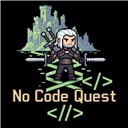
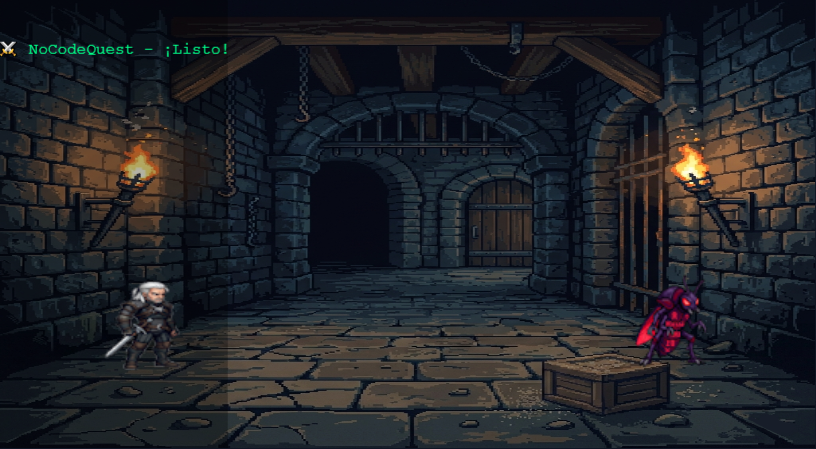
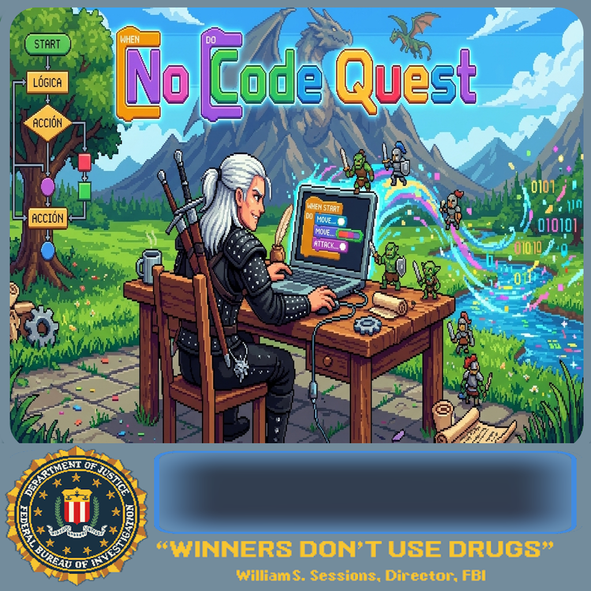
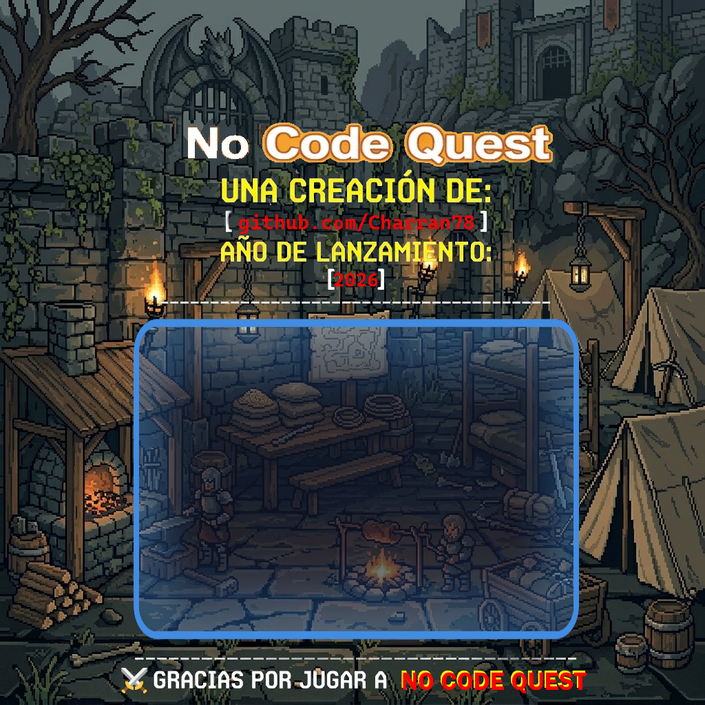
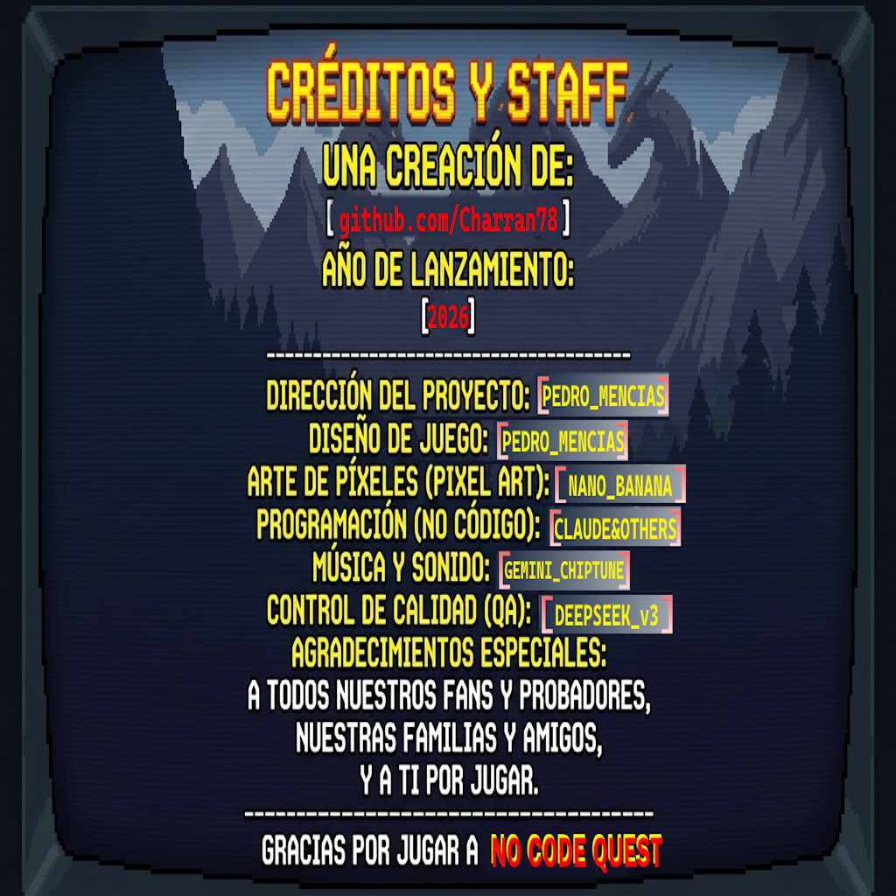

# NoCodeQuest RPG



> *"Tu IDE ya no es solo un editor. Es una mazmorra, un tablero de decisiones y una crónica viva."*

NoCodeQuest es una extension para VS Code que convierte el trabajo real del IDE en una aventura RPG pixel art. Diagnosticos, `TODO`, commits, diff, contexto del editor, inventario, mercado, cronica y decisiones HITL conviven en un unico WebView jugable.

La idea no es tapar el IDE con un juego, sino usar el juego como interfaz simbolica y accionable para trabajar mejor: el estado tecnico se refleja en la aventura y Jasper actua como bardo y copiloto, pero la ultima palabra siempre la tiene la persona que desarrolla.



---

## Vision
- Convertir el IDE en un "Espejo del IDE": una capa donde editor, juego e IA comparten contexto.
- Mantener un flujo HITL real: la IA sugiere, pero no ejecuta nada importante sin aprobacion humana.
- Hacer visible el estado tecnico con una UI mas memorable que una lista plana de paneles y logs.

---

## Estado Actual
- WebView jugable con splash, login, escena principal, HUD, panel lateral y chat overlay.
- Combate contra bugs con recompensas de EXP y oro.
- Misiones generadas desde `TODO` y `FIXME`.
- Inventario, mercado, armas, skins, pergaminos y pociones con efectos reales sobre la partida.
- Planta de la guarida como indicador simbolico de deuda tecnica.
- Cronica de aventuras persistente con detalle de eventos relevantes.
- Cartas de Destino generadas desde el estado real del IDE.
- Chat HITL de Jasper con sugerencias estructuradas ejecutables.
- Estado visible del oraculo en el chat: activo, cooldown, guia local o dormido.
- Controles de vista para mover, maximizar, teatro y zen mode.
- Pantalla de creditos y CTA flotante para colaborar con el desarrollo.

---

## Lo Que Hace Hoy
- **Combate**: los diagnosticos del editor pueden materializarse como amenazas y puedes atacarlas desde el panel.
- **Destino**: el oraculo local resume contexto del IDE y propone cartas con acciones utiles.
- **Jasper**: responde con tono narrativo, pero tambien con foco tecnico cuando la pregunta lo requiere.
- **Chat accionable**: desde el overlay puedes `Inspeccionar`, `Copiar IDE`, `Recrear`, `Actualizar` y exportar.
- **Commit ritualizado**: el panel puede preparar commits y sugerir mensaje.
- **Mercado e inventario**: comprar, equipar y consumir recursos funciona sin salir del juego.
- **Cronica**: cada accion importante deja huella en `adventureLog`.
- **Pantalla de creditos**: muestra accesos directos al repo, Open VSX y apoyo al dev.

---

## Instalacion

### Desde Open VSX
- Ficha publica: [NoCodeQuest en Open VSX](https://open-vsx.org/extension/pedromencias/nocodequest)

### Desde VSIX
1. Abre VS Code.
2. Ve a `Extensiones`.
3. Pulsa `...`.
4. Elige `Instalar desde VSIX...`.
5. Selecciona el `.vsix`.

### Desde codigo fuente
```bash
git clone https://github.com/Charran78/NoCodeQuest.git
cd NoCodeQuest
npm install
```

Despues abre el proyecto en VS Code y pulsa `F5` para lanzar la ventana de desarrollo de la extension.

---

## Primer Arranque
1. Abre cualquier proyecto en VS Code.
2. Ejecuta `NoCodeQuest: ⚔️ Iniciar Aventura`.
3. Espera a la splash y entra en el login.
4. Pulsa `Start`.
5. Usa `Destino`, `Inventario`, `Misiones`, `Mercado`, `Cronica` y `Chat` segun te convenga.

Comandos disponibles:
- `NoCodeQuest: ⚔️ Iniciar Aventura`
- `NoCodeQuest: 🧙 Ver Perfil del Aventurero`
- `NoCodeQuest: 🪞 Inspeccionar Estado del IDE`

---

## Recorrido Visual

### Splash
Pantalla de arranque con mensajes rotatorios, carga ligera y tono retro desde el primer paint.



### Login
Entrada a la aventura con fondo dedicado y acceso directo a `Start` y `Creditos`.



### Juego
Vista principal del WebView con escena, HUD, panel lateral, acciones, chat y cronica.


### Creditos
Pantalla de creditos con llamadas a la accion para seguir el repo, ver Open VSX o invitar un cafe al bardo.



---

## Flujo De Uso
1. Abres la aventura desde la paleta de comandos.
2. NoCodeQuest lee archivo activo, diagnosticos, estado Git, quests y progreso del jugador.
3. `Destino` te propone cartas segun ese contexto.
4. Jasper puede ampliar el siguiente paso con consejo narrativo y tecnico.
5. Tu decides si ejecutar, inspeccionar, refrescar contexto, copiar la respuesta al IDE o ignorarla.

Este es el nucleo HITL del proyecto: contexto real, sugerencia visible y accion humana explicita.

---

## Jasper Y El Oraculo

### Modo local
- Si no hay API key, Jasper sigue funcionando con guia local y mensajes de fallback.
- El badge del chat deja claro si el oraculo esta dormido o si estas usando guia local.

### Modo Groq
1. Consigue una API key en [console.groq.com/keys](https://console.groq.com/keys).
2. Ve a `Configuracion -> Extensiones -> NoCodeQuest RPG`.
3. Rellena `Groq Api Key`.
4. Opcionalmente cambia `Groq Model`.

Modelos utiles:
- `llama-3.1-8b-instant`
- `qwen-2.5-8b-instruct`
- `gemma2-9b-it`
- `llama-3.3-70b-versatile`

Notas:
- El sistema entra en cooldown temporal si Groq devuelve `429`, para evitar spam de errores.
- El badge del chat refleja si la respuesta viene del oraculo real o de fallback.
- La API key se guarda en ajustes de VS Code; no debe commitearse.

---

## UI Y Controles

### Zona de juego
- HUD superior con nivel, oro, rango, cafe, pergaminos y planta.
- Panel lateral con `Destino`, `Inventario`, `Misiones`, `Mercado` y `Cronica`.
- Barra de accion con ataque, consumibles, commit, chat, musica y accesos rapidos.

### Chat de Jasper
- `Inspeccionar`: intenta abrir el objetivo tecnico sugerido.
- `Copiar IDE`: copia la respuesta para pegarla en el chat del IDE.
- `Recrear`: vuelve a generar la respuesta con el contexto mas reciente.
- `Actualizar`: relee el IDE y avisa si hay o no diff real.
- `Exportar`: saca el transcript para soporte o seguimiento.

### Vista
- `IDE`: mueve el panel al grupo principal.
- `MAX`: maximiza o restaura el grupo actual.
- `THE`: activa modo teatro.
- `ZEN`: alterna zen mode del editor.

---

## Pantalla De Creditos
- Tiene fondo dedicado y el mismo formato base que splash y login.
- Se puede abrir desde el login o desde la bolita flotante de la esquina inferior derecha.
- Incluye enlaces directos al repo, Open VSX y pagina de apoyo al desarrollo.
- Tiene boton `Volver`, asi que puedes regresar a la pantalla anterior sin cerrar la extension.

Enlaces actuales:
- Repo: [github.com/Charran78/NoCodeQuest](https://github.com/Charran78/NoCodeQuest)
- Open VSX: [open-vsx.org/extension/pedromencias/nocodequest](https://open-vsx.org/extension/pedromencias/nocodequest)
- Cafe para el bardo: [buymeacoffee.com/beyonddigiv](https://buymeacoffee.com/beyonddigiv)

---

## Persistencia
- El estado de la partida se guarda en `.nocodequestrc.json` dentro del workspace.
- Existe un ejemplo en `.nocodequestrc.example.json`.
- Parte del runtime del WebView usa un espejo local en `.nocodequest/webview-runtime.json` para mantener sincronizado host y webview.

---

## Arquitectura
```text
[IDE] -> [Estado JSON] -> [Adventure Oracle] -> [Cartas de Destino]
   -> [WebView Phaser + Panel HITL] -> [Decision del jugador] -> [IDE]
```

Piezas principales:
- `extension.js`: orquestador entre VS Code, WebView, Git, runtime mirror y acciones del juego.
- `adventureOracle.js`: recopila `ide_state` y genera cartas con reglas fijas.
- `inventoryManager.js`: progreso, recursos, cronica y estado del jugador.
- `questBoard.js`: convierte `TODO` y `FIXME` en misiones.
- `narrationEngine.js`: integra Groq, cooldown por rate limit y fallback local.
- `compactSystem.js`: base del contrato `/compact` y parte del flujo HITL.
- `webview/panel.js`: HTML, CSS y bootstrap del WebView.
- `webview/modules/navigation.js`: splash, login, juego, creditos y carga diferida.
- `webview/modules/ui-renderer.js`: renderizado de chat, cartas, badge del oraculo e inventario.
- `webview/modules/event-handlers.js`: eventos de UI y puente de acciones al host.

---

## Roadmap

### Ahora
- Pulir UX y fiabilidad del bucle HITL.
- Seguir endureciendo la comunicacion host <-> webview.
- Mejorar feedback visual y sensacion de inmediatez.

### Siguiente
- Reforzar la conexion escena <-> IDE con mas feedback tecnico visible.
- Seguir afinando el equilibrio RPG, tienda y progresion.
- Completar QA de instalacion, packaging y distribucion.

### Mas adelante
- Enriquecer sugerencias estructuradas sin perder control humano.
- Ampliar assets, bosses, escenas y narrativa contextual.
- Publicar releases mas cerradas y documentadas.

---

## Notas De Diseno
- NoCodeQuest no busca automatizarlo todo.
- El objetivo es mantener a la persona dentro del flujo del IDE, no sustituir su criterio.
- El juego dramatiza el contexto, la IA propone y la persona decide.

---

## Creditos
- **Pedro Mencias**: vision del producto, direccion y arquitectura.
- **DeepSeek**: diseno narrativo, sistema y documentacion conceptual.
- **Claude**: implementacion y evolucion tecnica del codigo.
- **Gemini**: apoyo creativo y refinamiento visual.

---

## Licencia
MIT.

---

**"From factory floor to AI core, pasando por las mazmorras del codigo."**
